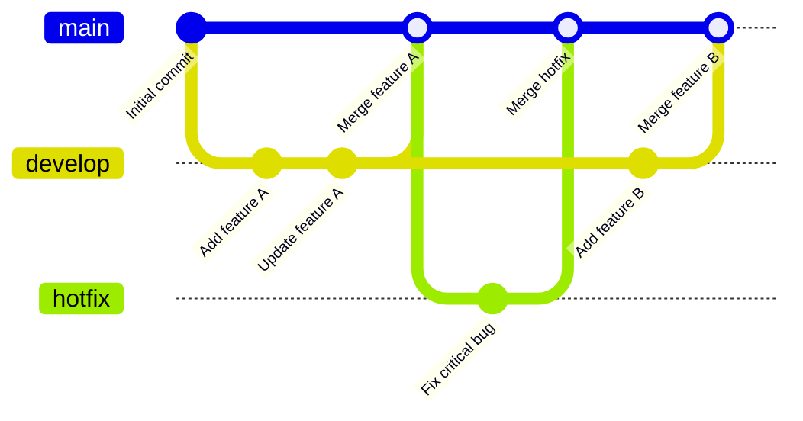
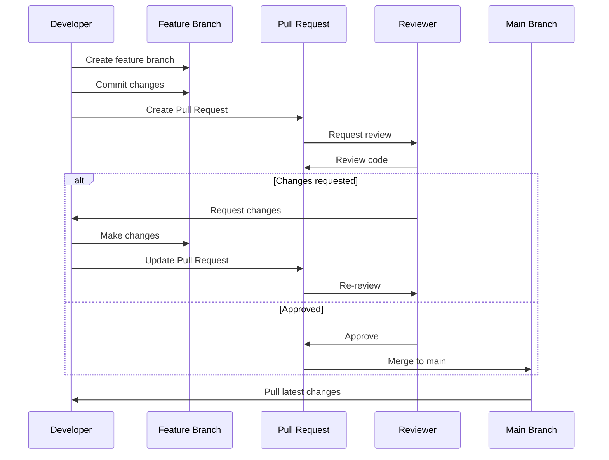

## 0.前言

最近Earn项目和Shooter老师需要协作，重新使用git、github协作，其中犯了不少错，做个总结。

## 1. Git 仓库操作图

以下图表展示了基本的 Git 仓库操作流程：



这个图表展示了：
1. 主分支（main）的初始提交
2. 创建和使用开发分支（develop）
3. 在开发分支上进行功能开发
4. 将开发分支合并回主分支
5. 创建热修复分支（hotfix）并合并
6. 继续在开发分支上开发新功能并最终合并

## 2. PR（Pull Request）工作流程图

以下是一个典型的 PR 工作流程：



这个流程图展示了：
1. 开发者创建功能分支并提交更改
2. 创建 Pull Request
3. 审查者审查代码
4. 如果需要更改，开发者进行修改并更新 PR
5. 一旦批准，PR 被合并到主分支
6. 开发者从主分支拉取最新更改

## 3. PR 示例

以下是一个 Pull Request 的文本示例：

```markdown
## 功能：添加用户认证系统

这个 PR 实现了基本的用户认证系统，包括注册、登录和注销功能。

### 更改内容：
- 添加了 `UserController` 用于处理用户相关请求
- 实现了 `RegistrationService` 和 `AuthenticationService`
- 添加了必要的数据模型和存储库
- 更新了配置文件以支持用户认证
- 添加了单元测试和集成测试

### 测试：
- 所有新添加的测试都已通过
- 手动测试了注册、登录和注销流程

### 注意事项：
- 这个 PR 引入了新的数据库迁移，请在合并后运行迁移脚本
- 需要更新环境变量以包含新的认证相关配置

请审查并提供反馈。谢谢！
```

## 4. Commit Message 示例

以下是一些良好的 commit message 示例：

1. 功能添加：
   ```
   feat: 实现用户注册功能
   
   - 添加 UserController 和 RegistrationService
   - 创建用户注册表单和验证逻辑
   - 实现邮箱验证流程
   ```

2. 错误修复：
   ```
   fix: 修复登录页面在移动设备上的显示问题
   
   - 调整登录表单的响应式布局
   - 修复输入框在小屏幕上被截断的问题
   ```

3. 重构：
   ```
   refactor: 优化数据库查询性能
   
   - 重写 UserRepository 中的 findByEmail 方法
   - 添加索引以提高查询效率
   - 将重复代码提取到公共方法
   ```

4. 文档更新：
   ```
   docs: 更新 README 文件
   
   - 添加项目设置说明
   - 更新 API 文档链接
   - 添加贡献指南
   ```

5. 测试：
   ```
   test: 为认证服务添加单元测试
   
   - 添加 AuthenticationService 的正面测试案例
   - 添加边缘情况和错误处理的测试
   - 模拟外部依赖以提高测试隔离性
   ```

这些示例遵循了常见的 commit message 约定，包括类型前缀（如 feat、fix、refactor、docs、test）、简洁的标题和详细的描述。

##  Changelog
- 241029 0xDragon888 创建 Git 仓库操作流程