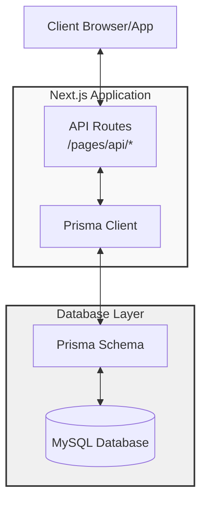

## 0.背景

这个项目使用的是 MySQL 数据库，并且通过 Prisma 作为 ORM（对象关系映射）工具来与数据库进行交互。API 是使用 Next.js 框架构建的。跟着我的脚步逐步深入理解使用 MySQL、Prisma 和 Next.js 构建的后端架构。以下是图解后端的整个架构：

## 1.图解后端架构



##  2. 熟悉各个核心组件

这个项目的后端架构大致可以分为以下几个组成部分：

- **数据库**：使用 MySQL 存储数据。
- **ORM（对象关系映射）**：使用 Prisma 来简化与数据库的交互。
- **API**：使用 Next.js 构建 RESTful API，定义在 `src/pages/api` 目录下，通过 HTTP 请求进行数据交互。

### 2. 数据库（MySQL）

- **MySQL** 是一个流行的关系数据库管理系统，使用 SQL 查询语言，能够高效存储和检索数据。
- 数据在 MySQL 中以表的形式组织，每个表有自己的行（记录）和列（字段）。

### 3. Prisma 作为 ORM

#### 3.1 Prisma 简介
Prisma 是一个现代化的 ORM，能简化数据库操作。它提供了强类型的数据库访问接口，支持多种数据库（包括 MySQL）。Prisma 的主要组成部分包括：

- **Prisma Client**：自动生成的用于数据库查询的客户端。
- **Prisma Schema**：描述数据库结构的文件，通常位于 `prisma/schema.prisma`。

#### 3.2 Prisma 的设置与使用
1. **安装 Prisma**：
   使用 npm 或 yarn 安装 Prisma 和 MySQL 驱动：
   ```bash
   npm install prisma @prisma/client
   ```

2. **初始化 Prisma**：
   初始化 Prisma，生成 `prisma` 文件夹和 schema 文件：
   ```bash
   npx prisma init
   ```

3. **定义模型**：
   在 `prisma/schema.prisma` 中定义数据库模型，例如：
   ```prisma
   datasource db {
     provider = "mysql"
     url      = env("DATABASE_URL")
   }
   
   generator client {
     provider = "prisma-client-js"
   }
   
   model User {
     id    Int     @id @default(autoincrement())
     name  String
     email String  @unique
   }
   ```

4. **迁移数据库**：
   运行以下命令将模型应用于 MySQL 数据库：
   ```bash
   npx prisma migrate dev --name init
   ```

5. **使用 Prisma Client**：
   在代码中引入 Prisma Client（通常在 `lib/prisma.ts` 中）：
   ```javascript
   import { PrismaClient } from '@prisma/client';
   
   const prisma = new PrismaClient();
   export default prisma;
   ```

### 4. Next.js API 路由

#### 4.1 API 路由结构
在 `src/pages/api` 目录下，您可以创建不同的文件来定义 API 路由。例如，创建一个 `users.js` 文件可以处理与用户相关的请求。

#### 4.2 处理 API 请求
在 API 路由文件中，您可以使用 Prisma Client 与数据库进行交互。以下是一个示例，展示如何处理 GET 和 POST 请求：

```javascript
import prisma from "../../lib/prisma";

// GET /api/users
export default async function handler(req, res) {
  if (req.method === "GET") {
    // 获取所有用户
    const users = await prisma.user.findMany();
    res.status(200).json(users);
  } else if (req.method === "POST") {
    // 创建新用户
    const { name, email } = req.body;
    const newUser = await prisma.user.create({
      data: { name, email },
    });
    res.status(201).json(newUser);
  } else {
    // 处理不支持的方法
    res.setHeader("Allow", ["GET", "POST"]);
    res.status(405).end(`Method ${req.method} Not Allowed`);
  }
}
```

### 5. 数据请求与响应

- 当浏览器或前端应用请求 `/api/users` 路由时，Next.js 会调用相应的处理函数。
- 根据请求方法（GET/POST），API 会通过 Prisma Client 访问 MySQL，返回用户数据或创建新用户。

### 6. 项目运行

最终，您可以通过以下命令启动开发服务器，测试 API：

```bash
npm run dev
```

然后在浏览器中访问 `http://localhost:3000/api/users` 检查 API 是否正常工作。

### 7. 概要

- **数据库**（MySQL）：存储数据。
- **Prisma**：作为 ORM 与数据库交互，处理数据模型和 CRUD 操作。
- **Next.js API**：在 `src/pages/api` 定义 API 路由，处理来自客户端的请求，并使用 Prisma 客户端完成数据操作。

## 3.工作流程

进一步理解这个后端架构,让我们从各个核心组件及其协同工作方式开始分析


工作流程说明:

1. **请求流程**:
   - 客户端发送 HTTP 请求到 Next.js API 端点
   - API 路由处理器接收请求
   - 使用 Prisma Client 执行数据库操作
   - 返回响应给客户端

2. **数据层交互**:
   - Prisma Schema 定义数据模型
   - Prisma Client 提供类型安全的数据库操作
   - MySQL 存储实际数据

3. **关键特性**:
   - 类型安全: Prisma 提供完整的类型推断
   - 自动迁移: 使用 `prisma migrate` 管理数据库架构
   - 查询优化: Prisma 自动优化数据库查询

4. **最佳实践**:
   - 使用环境变量管理数据库连接
   - 实现全局单例 Prisma Client
   - 适当的错误处理和请求验证

5. **概要**

   - **数据库**（MySQL）：存储数据。
   - **Prisma**：作为 ORM 与数据库交互，处理数据模型和 CRUD 操作。
   - **Next.js API**：在 `src/pages/api` 定义 API 路由，处理来自客户端的请求，并使用 Prisma 客户端完成数据操作。

## 4. 总结

使用 MySQL、Prisma 和 Next.js 构建的后端架构具有多种优势，适合快速开发和高效运作的应用程序。

- **快速开发**：Next.js 提供了一个易于使用的框架，允许开发者快速搭建和部署应用，特别是在构建 API 时。
- **统一的全栈**：Next.js 可以同时处理前端和后端逻辑，开发者可以在一个代码库中编写 React 组件和 API 路由，简化了项目结构和管理
- **微服务架构支持**：使用 Next.js 和 Prisma 可以轻松拆分不同的业务逻辑，支持微服务架构，使得应用更容易扩展和维护
- **丰富的插件和工具**：Next.js 和 Prisma 都有丰富的插件和工具，可以拓展功能，如身份验证、API Gateway、监控等，提升开发效率

